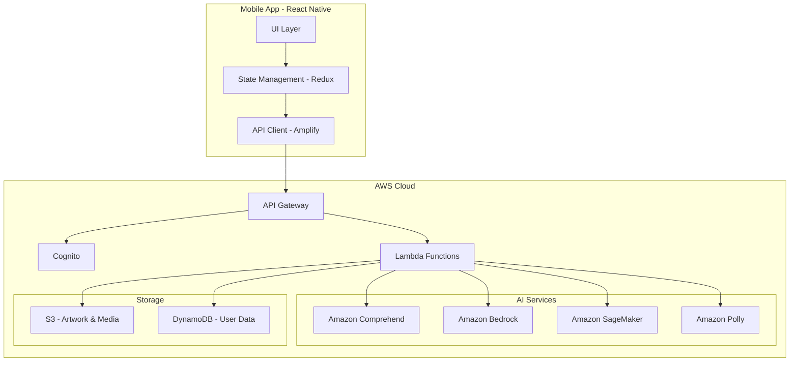
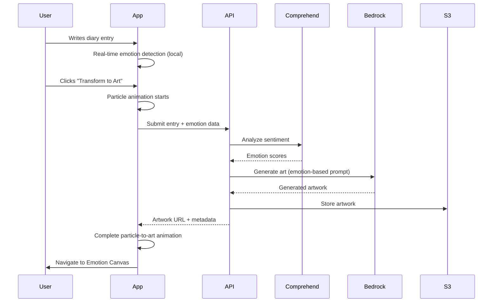

# Design Document

## Overview

DiaryToon is a React Native mobile application that transforms emotional journaling into an immersive art therapy experience. The system combines real-time emotional analysis, predictive AI modeling, and generative art to create a unique mental wellness platform. The core user flow is: Write → Analyze → Transform → Visualize → Predict.

The application uses a serverless AWS architecture with AI services for emotion detection (Amazon Comprehend), artwork generation (Amazon Bedrock with Stable Diffusion), predictive modeling (Amazon SageMaker), and text-to-speech (Amazon Polly). The frontend leverages React Native with Expo for cross-platform deployment, Three.js for 3D galaxy visualization, and Reanimated for smooth animations.

Key innovation: Every diary entry becomes a piece of art, creating a visual emotional timeline that users can explore in a 3D cosmic interface. The Emotional Digital Twin learns patterns and predicts emotional dips 2-7 days in advance, enabling proactive mental health interventions.

## Architecture

### High-Level Architecture



### Component Architecture

The application follows a layered architecture:

1. **Presentation Layer**: React Native components with emotion-reactive styling
2. **Business Logic Layer**: Redux state management with middleware for AI processing
3. **Data Access Layer**: AWS Amplify client with GraphQL/REST APIs
4. **AI Processing Layer**: Lambda functions orchestrating AWS AI services
5. **Storage Layer**: DynamoDB for structured data, S3 for media assets

### Data Flow: Diary to Art



## Components and Interfaces

### Frontend Components

#### 1. Onboarding Module
- **AvatarSelectionScreen**: Grid of AI companion avatars with customization options
- **AvatarCustomizer**: Color picker, accessory selector, name input
- **SeniorModePrompt**: Optional simplified mode selection
- **OnboardingFlow**: Wizard component managing multi-step onboarding

#### 2. Emotion Galaxy Module
- **GalaxyCanvas**: Three.js WebGL renderer for 3D cosmic visualization
- **CelestialObject**: Base class for stars, nebulas, moons, pulses
- **ArtworkStar**: Star component with embedded artwork thumbnail
- **TimelineSlider**: Date range selector with smooth scrubbing
- **TrendOverlay**: SVG path renderer for emotional trend lines
- **GalaxyControls**: Gesture handlers for zoom, rotate, pan

#### 3. Diary Writing Module
- **DiaryEditor**: Minimal text input with auto-save
- **EmotionMeter**: Real-time emotion detection visualization (circular gauge)
- **AdaptiveBackground**: Gradient background that shifts with emotion
- **WordCounter**: Live word count display
- **TransformButton**: Glowing CTA with pulse animation

#### 4. Art Transformation Module
- **ParticleSystem**: Canvas-based particle animation engine
- **TextToParticleAnimation**: Dissolves text into particles
- **ParticleToArtAnimation**: Morphs particles into artwork preview
- **TransformationOrchestrator**: Coordinates animation sequence

#### 5. Emotion Canvas Module
- **ArtworkViewer**: Full-screen image viewer with pinch-to-zoom
- **ColorPalette**: Extracted color swatches from artwork
- **MoodTag**: Pill-shaped emotion category label
- **AnimatedArtworkPlayer**: Plays motion version of artwork
- **MusicPlayer**: Audio controls for emotion-based soundtrack
- **SplitViewToggle**: Switches between full art and split diary/art view
- **ShareSheet**: Native share dialog for artwork export

#### 6. Cinematic Reel Module
- **ReelPlayer**: Video player with custom controls
- **TextFragmentOverlay**: Animated text appearing over visuals
- **ReelGenerator**: Combines artwork, text, music into video
- **ReelGallery**: Scrollable grid of generated reels

#### 7. AI Insight Module
- **DigitalTwinDashboard**: Main visualization container
- **StabilityScoreGauge**: 0-100 circular progress indicator
- **GrowthCurveChart**: Line chart showing emotional trajectory
- **StressPatternGraph**: Bar/line combo chart for stress cycles
- **EmotionalHeatmap**: Calendar-style heatmap
- **ArtTherapyImpactCard**: Score showing mood improvement from art
- **PredictionAlertCard**: Floating card with predicted emotional dips
- **GlowingAlertRing**: SVG ring animation around galaxy

#### 8. Safe Mode Module
- **SafeModeOverlay**: Full-screen calming blue overlay
- **SupportMessageCard**: Gentle reassurance message
- **HelplineList**: Emergency contact numbers with one-tap calling
- **SafeModeAnimationController**: Slows down all app animations

#### 9. Senior Mode Module
- **LargeTextWrapper**: Increases font sizes globally
- **SimplifiedNavigation**: Reduced menu with large touch targets
- **VoiceInputButton**: Speech-to-text for diary entries
- **HighContrastTheme**: Enhanced color contrast for readability

#### 10. Time Capsule Module
- **CapsuleCreator**: Multi-select diary entries + date picker
- **CapsuleVault**: Grid of locked capsules with countdown timers
- **CapsuleUnlockAnimation**: Celebration animation on unlock
- **CapsuleViewer**: Read-only view of capsule contents

### Backend Interfaces

#### API Endpoints (REST via API Gateway)

```typescript
// Diary Management
POST /diary/entries
GET /diary/entries/:id
GET /diary/entries?startDate&endDate
PUT /diary/entries/:id
DELETE /diary/entries/:id

// Art Generation
POST /art/generate
GET /art/:id
GET /art/gallery?userId

// Cinematic Reels
POST /reels/generate
GET /reels/:id
GET /reels/gallery?userId

// Emotional Analysis
POST /analysis/emotion
GET /analysis/patterns?userId
GET /analysis/predictions?userId

// Digital Twin
GET /twin/score?userId
GET /twin/growth?userId&period
GET /twin/heatmap?userId&year

// Time Capsules
POST /capsules
GET /capsules?userId
PUT /capsules/:id/unlock

// User Profile
GET /users/:id
PUT /users/:id
POST /users/:id/avatar
```

#### Lambda Functions

1. **DiaryProcessor**: Saves diary entry, triggers emotion analysis
2. **EmotionAnalyzer**: Calls Comprehend, extracts sentiment scores
3. **ArtGenerator**: Creates Bedrock prompt, generates artwork, stores in S3
4. **ReelComposer**: Combines artwork, text, music into video
5. **PredictionEngine**: Runs SageMaker model for emotional forecasting
6. **PatternDetector**: Identifies recurring emotional cycles
7. **SafeModeDetector**: Analyzes text for high-risk signals
8. **WellnessSuggester**: Generates culturally appropriate recommendations
9. **VoiceTranscriber**: Converts speech to text using Polly (reverse)
10. **NotificationDispatcher**: Sends push notifications for predictions/capsules

## Data Models

### User Profile
```typescript
interface UserProfile {
  userId: string;
  email: string;
  createdAt: Date;
  avatar: {
    type: string;
    customization: Record<string, any>;
  };
  preferences: {
    seniorMode: boolean;
    language: string;
    notificationsEnabled: boolean;
  };
  emotionalBaseline: {
    stabilityScore: number;
    lastUpdated: Date;
  };
}
```

### Diary Entry
```typescript
interface DiaryEntry {
  entryId: string;
  userId: string;
  content: string;
  wordCount: number;
  createdAt: Date;
  updatedAt: Date;
  emotionData: {
    primary: EmotionType;
    scores: {
      happiness: number;
      sadness: number;
      stress: number;
      anxiety: number;
      calmness: number;
    };
    confidence: number;
  };
  artworkId?: string;
  reelId?: string;
  isLocked: boolean; // For time capsules
}
```

### Artwork
```typescript
interface Artwork {
  artworkId: string;
  entryId: string;
  userId: string;
  imageUrl: string;
  thumbnailUrl: string;
  animatedUrl?: string;
  colorPalette: string[]; // Hex colors
  moodTag: EmotionType;
  generationPrompt: string;
  createdAt: Date;
  metadata: {
    model: string;
    seed: number;
    steps: number;
  };
}
```

### Cinematic Reel
```typescript
interface CinematicReel {
  reelId: string;
  entryId: string;
  userId: string;
  videoUrl: string;
  thumbnailUrl: string;
  duration: number; // seconds
  musicTrackId: string;
  textFragments: string[];
  createdAt: Date;
}
```

### Emotional Prediction
```typescript
interface EmotionalPrediction {
  predictionId: string;
  userId: string;
  predictedDate: Date;
  predictionType: 'stress_spike' | 'emotional_dip' | 'anxiety_increase';
  confidence: number; // 0-1
  severity: 'low' | 'medium' | 'high';
  suggestions: string[];
  createdAt: Date;
  acknowledged: boolean;
}
```

### Time Capsule
```typescript
interface TimeCapsule {
  capsuleId: string;
  userId: string;
  name: string;
  entryIds: string[];
  unlockDate: Date;
  createdAt: Date;
  isUnlocked: boolean;
  unlockedAt?: Date;
}
```

### Galaxy Visualization State
```typescript
interface GalaxyState {
  userId: string;
  celestialObjects: CelestialObject[];
  timeRange: {
    start: Date;
    end: Date;
  };
  trendOverlayVisible: boolean;
  cameraPosition: {
    x: number;
    y: number;
    z: number;
  };
  cameraRotation: {
    x: number;
    y: number;
    z: number;
  };
}

interface CelestialObject {
  id: string;
  type: 'star' | 'nebula' | 'moon' | 'pulse';
  position: { x: number; y: number; z: number };
  artworkId?: string;
  entryId: string;
  emotion: EmotionType;
  date: Date;
}
```


## Correctness Properties

*A property is a characteristic or behavior that should hold true across all valid executions of a system-essentially, a formal statement about what the system should do. Properties serve as the bridge between human-readable specifications and machine-verifiable correctness guarantees.*

### Property 1: Avatar Persistence
*For any* avatar selection, when a user completes the selection and saves it, retrieving the user profile should return the same avatar configuration.
**Validates: Requirements 1.3**

### Property 2: Star-Entry Correspondence
*For any* set of diary entries with generated artwork, the number of stars displayed in the Emotion Galaxy should equal the number of entries with artwork.
**Validates: Requirements 2.2**

### Property 3: Emotion-to-Celestial Mapping
*For any* diary entry with an emotional classification, the corresponding celestial object in the galaxy should match the emotion type (happy→star, sad→nebula, stress→red pulse, calm→moon).
**Validates: Requirements 2.3**

### Property 4: Star Navigation Correctness
*For any* star in the galaxy, tapping it should navigate to the Emotion Canvas screen displaying the artwork and diary entry associated with that star's entryId.
**Validates: Requirements 2.5**

### Property 5: Timeline Filtering
*For any* time range selected on the timeline slider, only diary entries with timestamps within that range should be displayed as celestial objects in the galaxy.
**Validates: Requirements 2.7**

### Property 6: Real-time Emotion Detection
*For any* text input in the diary editor, the emotion meter should update to reflect the emotional tone of the current text content.
**Validates: Requirements 3.3**

### Property 7: Emotion-Reactive Background
*For any* detected emotional tone while writing, the background color should adapt to match the emotion (e.g., warm colors for happiness, cool colors for sadness).
**Validates: Requirements 3.4**

### Property 8: Diary Entry Persistence
*For any* completed diary entry, saving it should result in the entry being stored with timestamp, content, and emotional metadata, and retrieving it should return the same data.
**Validates: Requirements 3.6**

### Property 9: Word Count Accuracy
*For any* text in the diary editor, the displayed word count should equal the actual number of words in the text.
**Validates: Requirements 3.7**

### Property 10: Prediction Generation
*For any* emotional pattern detected by the Digital Twin that indicates future stress, a prediction should be generated with confidence level, timeframe, and severity.
**Validates: Requirements 4.1**

### Property 11: Prediction Notification
*For any* generated prediction, a floating notification card should be displayed containing the prediction details.
**Validates: Requirements 4.3**

### Property 12: Wellness Suggestions
*For any* prediction generated, the system should provide at least one actionable wellness suggestion.
**Validates: Requirements 4.5**

### Property 13: Stability Score Range
*For any* user's Emotional Digital Twin, the displayed stability score should be within the range 0-100 inclusive.
**Validates: Requirements 5.1**

### Property 14: Tooltip Availability
*For any* interactive visualization element in the Digital Twin dashboard, hovering or tapping should display a tooltip with contextual information.
**Validates: Requirements 5.6**

### Property 15: Animation Duration Limit
*For any* transformation animation from text to particles to artwork, the complete sequence should finish within 3 seconds.
**Validates: Requirements 6.4**

### Property 16: Artwork Generation
*For any* diary entry transformed to art, the generated artwork should have emotional characteristics (color palette, mood tag) that match the entry's emotional classification.
**Validates: Requirements 6.5**

### Property 17: Color Palette Extraction
*For any* generated artwork displayed on the Emotion Canvas, a color palette should be extracted and displayed showing the dominant colors from the artwork.
**Validates: Requirements 7.2**

### Property 18: Mood Tag Display
*For any* artwork displayed on the Emotion Canvas, a mood tag should be shown indicating the emotional category of the source diary entry.
**Validates: Requirements 7.3**

### Property 19: Reel Duration Constraint
*For any* generated cinematic reel, the duration should be between 20 and 30 seconds inclusive.
**Validates: Requirements 8.1**

### Property 20: Reel Text Fragment Inclusion
*For any* cinematic reel generated from a diary entry, the reel should contain text fragments that are substrings of the original diary entry content.
**Validates: Requirements 8.2**

### Property 21: Reel Persistence
*For any* generated cinematic reel, it should be stored and retrievable from the gallery for future viewing.
**Validates: Requirements 8.6**

### Property 22: Safe Mode Activation
*For any* diary entry content containing high-risk emotional signals (detected by sentiment analysis), Safe Mode should be automatically activated.
**Validates: Requirements 9.1**

### Property 23: Safe Mode Animation Slowdown
*For any* animation playing while Safe Mode is active, the animation speed should be reduced compared to normal mode.
**Validates: Requirements 9.3**

### Property 24: Senior Mode Text Scaling
*For any* text element when Senior Mode is enabled, the font size should be larger and contrast ratio should be higher than in normal mode.
**Validates: Requirements 10.1**

### Property 25: Senior Mode Navigation Simplification
*For any* navigation menu when Senior Mode is enabled, the number of menu items should be fewer than in normal mode.
**Validates: Requirements 10.2**

### Property 26: Future Date Acceptance
*For any* time capsule creation, the system should accept unlock dates that are in the future relative to the current date.
**Validates: Requirements 11.2**

### Property 27: Time Capsule Access Control
*For any* time capsule with an unlock date in the future, the locked diary entries should not be accessible until the unlock date arrives.
**Validates: Requirements 11.3**

### Property 28: Time Capsule Unlocking
*For any* time capsule when the unlock date arrives, the system should unlock the capsule, send a notification, and make the entries accessible.
**Validates: Requirements 11.4**

### Property 29: Capsule Vault Completeness
*For any* user's time capsules, the Time Capsule Vault should display all capsules with their unlock dates and preview information.
**Validates: Requirements 11.5**

### Property 30: Stress-Triggered Breathing Animation
*For any* diary content where stress is detected, the background should display breathing motion animations.
**Validates: Requirements 12.1**

### Property 31: Emotional Theme Transitions
*For any* change in detected emotional state, the background theme should smoothly transition to emotion-reactive colors matching the new state.
**Validates: Requirements 12.2**

### Property 32: Calm State Visual Effects
*For any* diary content where calmness is detected, the UI should apply soft gradients and gentle particle effects.
**Validates: Requirements 12.3**

### Property 33: Anxiety State UI Simplification
*For any* diary content where anxiety is detected, the UI should reduce visual complexity and slow animation timing.
**Validates: Requirements 12.4**

### Property 34: Glassmorphism Application
*For any* UI card component rendered in the application, glassmorphism effects with frosted transparency should be applied.
**Validates: Requirements 13.1**

### Property 35: Interaction Feedback Animation
*For any* user interaction (tap, swipe, press), a micro-animation should be triggered as visual feedback.
**Validates: Requirements 13.3**

### Property 36: Animation Performance
*For any* visual element animation, the animation should complete within 300 milliseconds.
**Validates: Requirements 13.5**

### Property 37: Comprehend Integration
*For any* diary entry requiring emotional analysis, the system should call Amazon Comprehend to process the text.
**Validates: Requirements 14.2**

### Property 38: Bedrock Art Generation
*For any* artwork generation request, the system should send emotion-based prompts to Amazon Bedrock.
**Validates: Requirements 14.3**

### Property 39: SageMaker Model Updates
*For any* prediction generation, Amazon SageMaker should be used to update the Emotional Digital Twin model.
**Validates: Requirements 14.4**

### Property 40: S3 Encrypted Storage
*For any* generated artwork, it should be stored in Amazon S3 with encryption enabled.
**Validates: Requirements 14.5**

### Property 41: S3 Artwork Retrieval
*For any* artwork retrieval request from the mobile app, the artwork should be served from Amazon S3.
**Validates: Requirements 14.6**

### Property 42: Polly Voice Synthesis
*For any* voice feature request (e.g., reading diary entries aloud), Amazon Polly should be used for speech synthesis.
**Validates: Requirements 14.8**

### Property 43: Automatic Sentiment Analysis
*For any* saved diary entry, the system should automatically analyze the text for emotional sentiment.
**Validates: Requirements 15.1**

### Property 44: Complete Emotion Extraction
*For any* completed sentiment analysis, the system should extract all five emotion categories: happiness, sadness, stress, anxiety, and calmness.
**Validates: Requirements 15.2**

### Property 45: Digital Twin Updates
*For any* extracted emotional data, the Emotional Digital Twin model should be updated with the new data points.
**Validates: Requirements 15.3**

### Property 46: Pattern Identification
*For any* user with sufficient diary entry data (10+ entries), the system should identify recurring emotional patterns and cycles.
**Validates: Requirements 15.4**

### Property 47: Analysis Performance
*For any* emotional analysis operation, the processing should complete within 3 seconds.
**Validates: Requirements 15.5**

### Property 48: Negative Pattern Suggestions
*For any* negative emotional pattern identified by the Digital Twin, the system should generate contextually relevant wellness suggestions.
**Validates: Requirements 16.1**

### Property 49: Actionable Suggestion Content
*For any* wellness suggestion displayed, it should contain actionable steps with clear instructions.
**Validates: Requirements 16.3**

### Property 50: Suggestion Engagement Tracking
*For any* wellness suggestion that a user follows, the system should track the engagement and measure effectiveness over time.
**Validates: Requirements 16.4**

## Error Handling

### Client-Side Error Handling

1. **Network Failures**
   - Implement exponential backoff retry logic for API calls
   - Cache diary entries locally if submission fails
   - Display user-friendly error messages with retry options
   - Maintain offline queue for pending operations

2. **Animation Errors**
   - Gracefully degrade to static views if WebGL/Three.js fails
   - Provide fallback 2D galaxy visualization
   - Skip particle animations if performance is poor

3. **Media Loading Failures**
   - Show placeholder images for artwork that fails to load
   - Retry artwork generation if Bedrock request fails
   - Cache generated artwork locally for offline viewing

4. **Input Validation**
   - Validate diary entry length (max 10,000 characters)
   - Sanitize user input to prevent XSS attacks
   - Validate date inputs for time capsules (must be future dates)
   - Validate avatar customization parameters

### Server-Side Error Handling

1. **AI Service Failures**
   - Implement circuit breaker pattern for Comprehend/Bedrock calls
   - Fall back to cached emotion scores if Comprehend is unavailable
   - Queue artwork generation requests if Bedrock is rate-limited
   - Retry SageMaker predictions with exponential backoff

2. **Storage Failures**
   - Implement S3 multipart upload with retry for large artwork files
   - Use DynamoDB conditional writes to prevent race conditions
   - Implement backup storage strategy for critical user data
   - Log all storage failures for monitoring

3. **Authentication Errors**
   - Handle Cognito token expiration with automatic refresh
   - Implement secure session management
   - Provide clear error messages for invalid credentials
   - Support account recovery flows

4. **Rate Limiting**
   - Implement per-user rate limits for artwork generation (5 per hour)
   - Queue requests that exceed rate limits
   - Display wait time estimates to users
   - Prioritize critical operations (Safe Mode, predictions)

### Safe Mode Error Handling

1. **Crisis Detection Failures**
   - If sentiment analysis fails, err on the side of caution and activate Safe Mode
   - Maintain local crisis keyword list as fallback
   - Log all detection failures for model improvement

2. **Support Resource Availability**
   - Cache helpline numbers locally for offline access
   - Provide multiple contact methods (phone, text, web)
   - Display resources even if network is unavailable

## Testing Strategy

### Unit Testing

The application will use Jest for JavaScript/TypeScript unit testing and React Native Testing Library for component testing.

**Unit Test Coverage:**

1. **Component Tests**
   - Test each React Native component in isolation
   - Mock external dependencies (API calls, navigation)
   - Test component rendering with various props
   - Test user interaction handlers (onPress, onChangeText)
   - Example: Test that DiaryEditor renders correctly and handles text input

2. **Business Logic Tests**
   - Test Redux reducers and action creators
   - Test utility functions (emotion detection, color extraction, word counting)
   - Test data transformation functions
   - Example: Test that word count function correctly counts words in various text formats

3. **API Integration Tests**
   - Test API client functions with mocked responses
   - Test error handling for failed requests
   - Test request/response data transformation
   - Example: Test that artwork generation API call sends correct parameters

4. **Animation Tests**
   - Test animation timing and sequencing
   - Test animation completion callbacks
   - Example: Test that particle animation completes within 3 seconds

### Property-Based Testing

The application will use fast-check for property-based testing in JavaScript/TypeScript. Each property-based test will run a minimum of 100 iterations to ensure comprehensive coverage.

**Property-Based Test Requirements:**

- Each test must be tagged with a comment referencing the correctness property from this design document
- Tag format: `// Feature: diarytoon-app, Property {number}: {property_text}`
- Each correctness property must be implemented by a single property-based test
- Tests should generate random valid inputs to verify properties hold across all cases

**Property Test Coverage:**

1. **Data Persistence Properties**
   - Property 1: Avatar Persistence
   - Property 8: Diary Entry Persistence
   - Property 21: Reel Persistence
   - Property 40: S3 Encrypted Storage

2. **UI Consistency Properties**
   - Property 2: Star-Entry Correspondence
   - Property 3: Emotion-to-Celestial Mapping
   - Property 5: Timeline Filtering
   - Property 29: Capsule Vault Completeness

3. **Real-time Behavior Properties**
   - Property 6: Real-time Emotion Detection
   - Property 7: Emotion-Reactive Background
   - Property 9: Word Count Accuracy

4. **AI Integration Properties**
   - Property 10: Prediction Generation
   - Property 16: Artwork Generation
   - Property 43: Automatic Sentiment Analysis
   - Property 44: Complete Emotion Extraction

5. **Performance Properties**
   - Property 15: Animation Duration Limit
   - Property 19: Reel Duration Constraint
   - Property 36: Animation Performance
   - Property 47: Analysis Performance

6. **Access Control Properties**
   - Property 26: Future Date Acceptance
   - Property 27: Time Capsule Access Control
   - Property 28: Time Capsule Unlocking

7. **Adaptive UI Properties**
   - Property 22: Safe Mode Activation
   - Property 23: Safe Mode Animation Slowdown
   - Property 24: Senior Mode Text Scaling
   - Property 30: Stress-Triggered Breathing Animation
   - Property 31: Emotional Theme Transitions

8. **AWS Integration Properties**
   - Property 37: Comprehend Integration
   - Property 38: Bedrock Art Generation
   - Property 39: SageMaker Model Updates
   - Property 42: Polly Voice Synthesis

### Integration Testing

1. **End-to-End User Flows**
   - Test complete diary entry creation → artwork generation → galaxy visualization flow
   - Test onboarding → avatar selection → first diary entry flow
   - Test prediction generation → notification → wellness suggestions flow
   - Test time capsule creation → locking → unlocking flow

2. **AWS Service Integration**
   - Test Lambda function invocations with real AWS services in staging environment
   - Test S3 upload/download with encryption
   - Test Cognito authentication flows
   - Test Comprehend sentiment analysis with sample diary entries
   - Test Bedrock artwork generation with emotion-based prompts

3. **Performance Testing**
   - Test galaxy rendering with 100+ diary entries
   - Test animation performance on low-end devices
   - Test API response times under load
   - Test artwork generation latency

### Manual Testing

1. **Visual Design Validation**
   - Verify glassmorphism effects render correctly
   - Verify particle animations are smooth
   - Verify color transitions are gradual and pleasant
   - Verify Safe Mode visual changes are calming

2. **Accessibility Testing**
   - Test Senior Mode with larger text and simplified navigation
   - Test voice input functionality
   - Test screen reader compatibility
   - Test color contrast ratios

3. **Cultural Appropriateness**
   - Review wellness suggestions for Indian cultural context
   - Review language and examples in Senior Mode
   - Review helpline numbers for Indian users

4. **User Experience Testing**
   - Test emotional impact of Safe Mode activation
   - Test intuitiveness of galaxy navigation
   - Test clarity of prediction notifications
   - Test satisfaction with generated artwork


